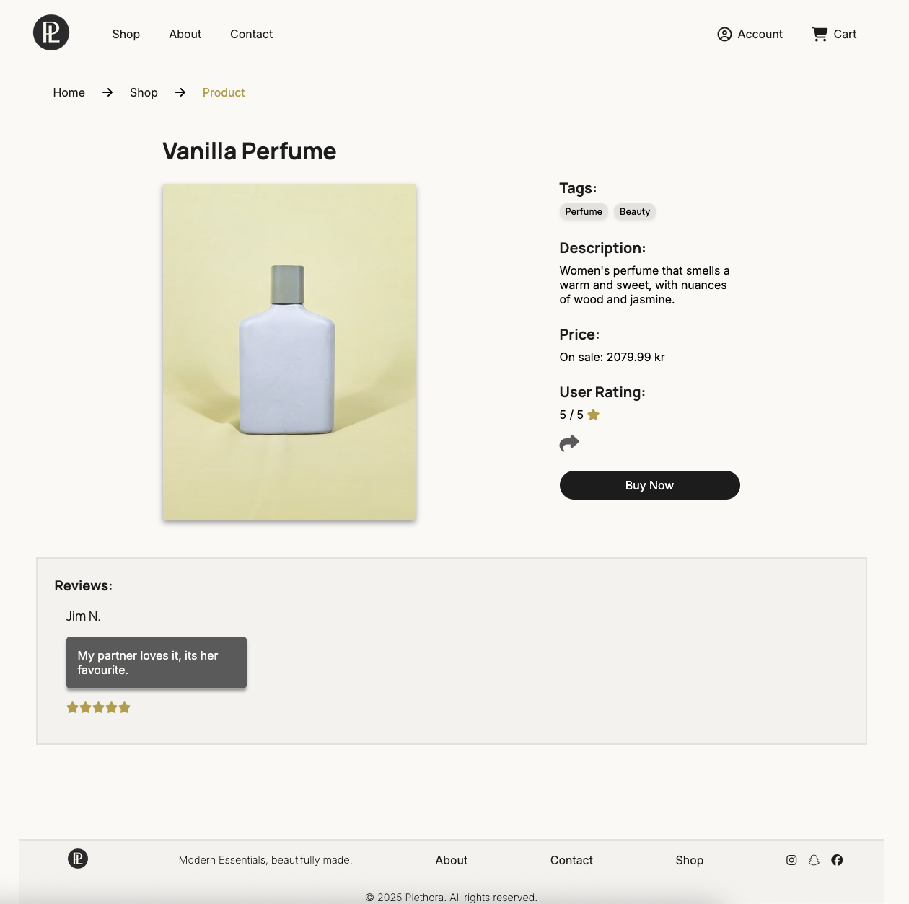

# Project Exam 1

A front-end user interface for an existing e-commerce API.

---

## 📸 Screenshot



---

## 🛠️ Built With

List the main tools and technologies used in this project:


---

## 📦 Installation

Follow these steps to get a copy of the project running locally:

1. Clone the repository:

   ```bash
   git clone https://github.com/AlexanderLislelid/Project-Exam-1.git
   ```

2. Open the repository:

```bash
  cd Project-Exam-1
```

3. Run Live Server

```markdown
You can open the project using Live Server in VS Code:

1. Open the folder in VS Code
2. Right-click `index.html`
3. Select **“Open with Live Server”**
```

## License

MIT License

## Contact

Alexander Lislelid - [@twitter_handle](https://twitter.com/twitter_handle) - alexlislelid@gmail.com

Project Link: [https://github.com/AlexanderLislelid/Project-Exam-1](https://github.com/AlexanderLislelid/Project-Exam-1)

```

```

```

```
